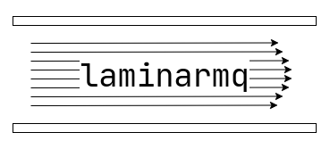
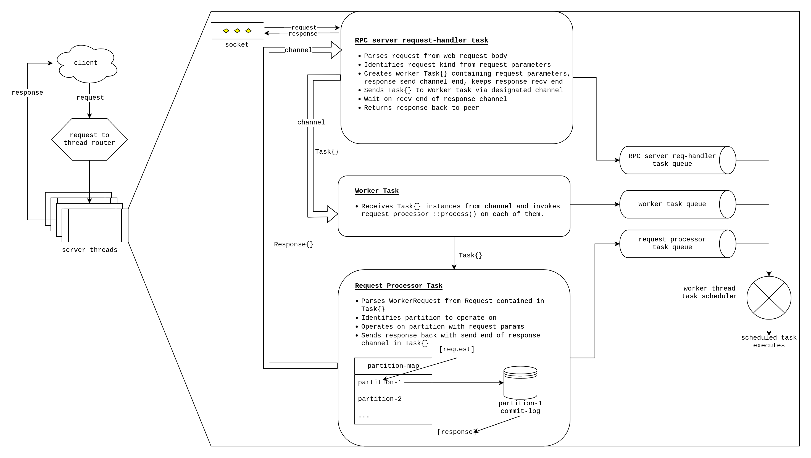
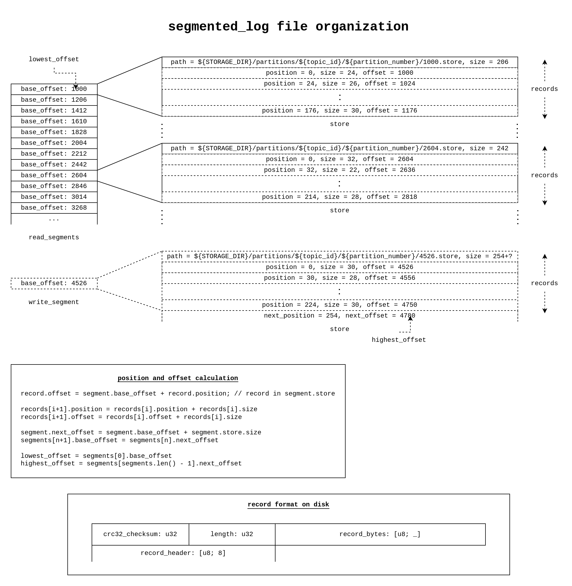

<p align="center">
  
</p>

<p align="center">
  <a href="https://github.com/arindas/laminarmq/actions/workflows/ci.yml">
  
  </a>
  <a href="https://codecov.io/gh/arindas/laminarmq" >
  
  </a>
  <a href="https://crates.io/crates/laminarmq">
  
  </a>
  <a href="https://github.com/arindas/laminarmq/actions/workflows/rustdoc.yml">
  
  </a>
</p>

<p align="center">
A scalable, distributed message queue powered by a segmented, partitioned, replicated and immutable log.
<br><i>This is currently a work in progress.</i>
</p>

## Usage
`laminarmq` provides a library crate and two binaries for managing `laminarmq` deployments.
In order to use `laminarmq` as a library, add the following to your `Cargo.toml`:
```toml
[dependencies]
laminarmq = "0.0.4"
```

The current implementation based on [`glommio`](https://docs.rs/glommio) runs only on linux. `glommio` requires
`io_uring` support in the linux kernel.
>Glommio requires a kernel with a recent enough `io_uring` support, at least current enough to run discovery probes. The
>minimum version at this time is 5.8.
>
>Please also note Glommio requires at least 512 KiB of locked memory for `io_uring` to work. You can increase the
>`memlock` resource limit (rlimit) as follows:
>
>```sh
>$ vi /etc/security/limits.conf
>*    hard    memlock        512
>*    soft    memlock        512
>```
>
>> Please note that 512 KiB is the minimum needed to spawn a single executor. Spawning multiple executors may require you
>> to raise the limit accordingly.
>To make the new limits effective, you need to log in to the machine again. You can verify that the limits are updated by
>running the following:
>
>```sh
>$ ulimit -l
>512
>```

Refer to latest git [API Documentation](https://arindas.github.io/laminarmq/laminarmq/)
or [Crate Documentation](https://docs.rs/laminarmq) for more details.

`laminarmq` presents an elementary commit-log abstraction (a series of records ordered by offsets), on top of which
several message queue semantics such as publish subscribe or even full blown protocols like MQTT could be implemented.
Users are free to read the messages with offsets in any order they need.

## Major milestones for `laminarmq`
- [ ] Single node, single threaded message queue with RPC server
- [ ] Single node, multi threaded, eBPF based request to thread routed message queue
- [ ] Service discovery with [SWIM](https://www.cs.cornell.edu/projects/Quicksilver/public_pdfs/SWIM.pdf).
- [ ] Replication and consensus of replicated records with [Raft](https://raft.github.io/raft.pdf).

## Design
This section describes the internal design of `laminarmq`.

### Execution Model



`laminarmq` uses the thread-per-core execution model where individual processor cores are limited to single threads.
This model encourages design that minimizes inter-thread contention and locks, thereby improving tail latencies in
software services. Read: [The Impact of Thread per Core Architecture on Application Tail Latency.](
https://helda.helsinki.fi//bitstream/handle/10138/313642/tpc_ancs19.pdf?sequence=1)

In our case, each thread is responsible for servicing only a subset of the partitions. Requests pertaining to a specific
partition are always routed to the same thread. This greatly increases locality of requests. The routing mechanism
could be implemented in a several ways:
- Each thread listens on a unique port. We have a reverse proxy of sorts to forward requests to specific ports.
- An eBPF based packet filter is used to route packets to appropriate threads based on the topic and partition of
the request to which the packet belongs to.

Since each processor core is limited to a single thread, tasks in a thread need to be scheduled efficiently. Hence each
worker thread runs their own task scheduler. Tasks can be scheduled on different task queues and different task queues
can be provisioned with specific fractions of CPU time shares.

The current implementation only provides a single node, single threaded server; request routing is yet to be
implemented. However, the eBPF route is more desirable since it doesn't require any additional dependency on the
user's end.

`laminarmq` is generic enough to be implemented with different `async` runtimes. However, for our initial release
we have elected [`glommio`](https://docs.rs/glommio) as our thread-per-core runtime. `glommio` leverages the new
linux 5.x [`io_uring`](https://kernel.dk/io_uring.pdf) API which facilitates true asynchronous IO for both
networking and disk interfaces. (Other `async` runtimes such as [`tokio`](https://docs.rs/tokio) make blocking
system calls for disk IO operations in a thread-pool.)

`io_uring` also has the advantage of being able to queue together multiple system calls together and then
asynchronously wait for their completion by making a maximum of one context switch. It is also possible to
avoid context switches altogether. This is achieved with a pair of ring buffers called the submission-queue
and the completion-queue. Once the queues are set up, user can queue multiple system calls on the submission
queue. The linux kernel processes the system calls and places the results in the completion queue. The user
can then freely read the results from the completion-queue. This entire process after setting up the queues
doesn't require any additional context switch.

Read more: https://man.archlinux.org/man/io_uring.7.en

`glommio` presents additional abstractions on top of `io_uring` in the form of an async runtime, with support
for networking, disk IO, channels, single threaded locks and more.

Read more: https://www.datadoghq.com/blog/engineering/introducing-glommio/

### Architecture
This section describes the planned architecture for making our message queue distributed across multiple nodes.

#### Storage Hierarchy
Data is persisted in `laminarmq` with the following hierarchy:

```text
[cluster]
├── node#001
│   ├── (topic#001 -> partition#001) [L]
│   │   └── segmented_log{[segment#001, segment#002, ...]}
│   ├── (topic#001 -> partition#002) [L]
│   │   └── segmented_log{[segment#001, segment#002, ...]}
│   └── (topic#002 -> partition#001) [F]
│       └── segmented_log{[segment#001, segment#002, ...]}
├── node#002
│   ├── (topic#001 -> partition#002) [F]
│   │   └── segmented_log{[segment#001, segment#002, ...]}
│   └── (topic#002 -> partition#001) [L]
│       └── segmented_log{[segment#001, segment#002, ...]}
└── ...other nodes
```

Every "partition" is backed by a persistent, segmented log. A log is an append only collection of "message"(s).
Messages in a "partition" are accessed using their "offset" i.e. location of the "message"'s bytes in the log.

#### `segmented_log`: Persistent data structure for storing records in a partition
The segmented-log data structure for storing records is inspired from
[Apache Kafka](https://www.microsoft.com/en-us/research/wp-content/uploads/2017/09/Kafka.pdf).



A segmented log is a collection of read segments and a single write segment. Each "segment" is backed by a 
storage file on disk called "store".

The log is:
- "immutable", since only "append", "read" and "truncate" operations are allowed. It is not possible to update 
or delete records from the middle of the log. 
- "segmented", since it is composed of segments, where each segment services records from a particular range
of offsets.

All writes go to the write segment. A new record is written at `offset = write_segment.next_offset` in the write 
segment. When we max out the capacity of the write segment, we close the write segment and reopen it as a read 
segment. The re-opened segment is added to the list of read segments. A new write segment is then created with 
`base_offset` equal to the `next_offset` of the previous write segment.

When reading from a particular offset, we linearly check which segment contains the given
read segment. If a segment capable of servicing a read from the given offset is found, we
read from that segment. If no such segment is found among the read segments, we default to
the write segment. The following scenarios may occur when reading from the write segment in
this case:
- The write segment has synced the messages including the message at the given offset. In
this case the record is read successfully and returned.
- The write segment hasn't synced the data at the given offset. In this case the read fails
with a segment I/O error.
- If the offset is out of bounds of even the write segment, we return an "out of bounds"
error.


#### Replication and Partitioning (or redundancy and horizontal scaling)
A particular "node" contains some or all "partition"(s) of a "topic". Hence a "topic" is both partitioned and
replicated within the nodes. The data is partitioned with the dividing of the data among the "partition"(s),
and replicated by replicating these "partition"(s) among the other "node"(s).

Each partition is part of a Raft group; e.g each replica of `(topic#001 -> partition#001)` is part of a Raft
group, while each replica of `(topic#002 -> partition#002)` are part of a different Raft group. A particular
"node" might host some Raft leader "partition"(s) as well as Raft follower "partition"(s). For instance in the
above example data persistence hierarchy, the `[L]` denote leaders, and the `[F]` denote followers.

If a node goes down:
- For every leader partition in that node:
  - if there are no other follower replicas in other nodes in it's Raft group, that partition goes down.
  - if there are other follower replicas in other nodes, there are leader elections among them and after a
  leader is elected, reads and writes for that partition proceed normally
- For every follower partition in that node:
  - the remaining replicas in the same raft group continue to function in accordance with Raft's mechanisms.

[CockroachDB](https://www.cockroachlabs.com/) and [Tikv](https://tikv.org) call this manner of using different
Raft groups for different data buckets on the same node as MultiRaft.

Read more here:
- https://tikv.org/deep-dive/scalability/multi-raft/
- https://www.cockroachlabs.com/blog/scaling-raft/

#### Service Discovery
Now we maintain a "member-list" abstraction of all "node"(s) which states which nodes are online in real time.
This "member-list" abstraction is able to respond to events such as a new node joining or leaving the cluster.
(It internally uses a gossip protocol for membership information dissemination.) This abstraction can also
handle queries like the different "partition"(s) hosted by a particular node. Using this we do the following:
- Create new replicas of partitions or rebalance partitions when a node joins or leaves the cluster.
- Identify which node holds which partition in real time. This information can be used for client side load
balancing when reading or writing to a particular partition.

#### Data Retention SLA
A "segment_age" configuration is made available to configure the maximum allowed age of segments. Since all
partitions maintain consistency using Raft consensus, they have completely identical message-segment distribution.
At regular intervals, segments with age greater than the specified "segment_age" are removed and the messages
stored in these segments are lost. A good value for "segment_age" could be `7 days`.

## Testing
`laminarmq` is currently implemented with the `glommio` async runtime which requires an updated linux kernel
(at least 5.8) with `io_uring` support. `glommio` also requires at least 512 KiB of locked memory for
`io_uring` to work. (Note: 512 KiB is the minimum needed to spawn a single executor. Spawning multiple
executors may require you to raise the limit accordingly. I recommend 8192 KiB on a 8 GiB RAM machine.)

First, check the current `memlock` limit:
```sh
ulimit -l

# 512 ## sample output
```

If the `memlock` resource limit (rlimit) is lesser than 512 KiB, you can increase it as follows:
```sh
sudo vi /etc/security/limits.conf
*    hard    memlock        512
*    soft    memlock        512
```

To make the new limits effective, you need to log in to the machine again. Verify whether the limits have
been reflected with `ulimit` as described above.

>(On old WSL versions, you might need to spawn a login shell every time for the limits to be reflected:
>```sh
>su ${USER} -l
>```
>The limits persist once inside the login shell.
>
>This is not necessary on the latest WSL2 version as of 22.12.2022)

Finally, clone the repository and run the tests:
```sh
git clone https://github.com/arindas/laminarmq.git
cd laminarmq/
cargo test
```

## License
`laminarmq` is licensed under the MIT License. See [License](./LICENSE) for more details.
